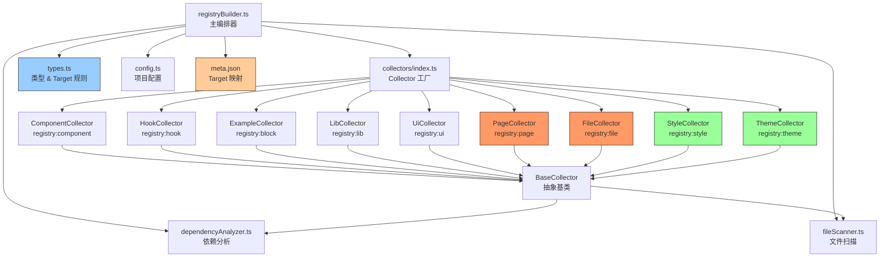

## 文件结构

```
packages/registry/server/
├── hooks/
│   └── index.ts                  # Nitro build hook → 调用 registryBuilder
├── routes/
│   ├── [component].json.ts       # HTTP handler: 按名称返回 registry item
│   ├── index.ts                  # 首页
│   └── mcp.ts                    # MCP server endpoint
├── collectors/                   # 各类型的 Collector 实现
│   ├── baseCollector.ts          # 抽象基类 (验证、依赖分析、resolveTarget)
│   ├── componentCollector.ts     # registry:component
│   ├── hookCollector.ts          # registry:hook (composables)
│   ├── exampleCollector.ts       # registry:block
│   ├── libCollector.ts           # registry:lib
│   ├── uiCollector.ts            # registry:ui
│   ├── pageCollector.ts          # registry:page  (target 必填)
│   ├── fileCollector.ts          # registry:file   (target 必填)
│   ├── styleCollector.ts         # registry:style  (JSON-only, cssVars/css)
│   ├── themeCollector.ts         # registry:theme  (JSON-only, cssVars)
│   └── index.ts                  # 工厂: createDefaultCollectors()
└── utils/
    ├── config.ts                 # 项目配置 (baseName, baseUrl 等)
    ├── types.ts                  # 统一类型 + Target 必填规则 + TargetMeta
    ├── dependencyAnalyzer.ts     # ts-morph 导入解析 & 依赖分析
    ├── fileScanner.ts            # 通用文件遍历 & 源码提取
    └── registryBuilder.ts        # 精简的主编排器
```

## Target 规则

在 `types.ts` 的 `TARGET_REQUIRED_TYPES` 中定义为单一事实来源。

target 解析优先级（由 `baseCollector.ts` 的 `resolveTarget()` 管理）：

1. `meta.json` 中的显式映射（最高优先级）
2. Collector 提供的 fallback 默认值
3. `undefined`（仅对可选类型）

| 类型                 | target   | 默认值                        |
| -------------------- | -------- | ----------------------------- |
| `registry:component` | 可选     | 不设置（shadcn-vue 自动处理） |
| `registry:hook`      | 可选     | 不设置（可通过 meta.json 覆盖）|
| `registry:lib`       | 可选     | 不设置（可通过 meta.json 覆盖）|
| `registry:ui`        | 可选     | 不设置                        |
| `registry:block`     | 可选     | 不设置                        |
| `registry:page`      | **必填** | `pages/<relative-path>`       |
| `registry:file`      | **必填** | 由 collector 显式设置         |
| `registry:style`     | —        | JSON-only，无文件             |
| `registry:theme`     | —        | JSON-only，无文件             |

## meta.json

位于 `packages/elements/meta.json`，存储 `path → target` 映射：

```json
{
  "targets": {
    "pages/ChatPage.vue": "pages/chat/index.vue",
    "files/ai-config.ts": "config/ai-config.ts"
  }
}
```

所有 Collector 在设置 `target` 时都会先查询 `meta.json`，
再 fallback 到默认值。这使得 target 可以在不修改代码的情况下灵活配置。

## Collector 类型

| Collector         | 数据来源                       | 输出到 all.json | 输出到 registry.json |
| ----------------- | ------------------------------ | --------------- | -------------------- |
| Component         | `src/components/` 扫描         | ✅              | ✅                   |
| Hook              | `src/composables/` 扫描        | ✅              | ✅                   |
| Lib               | `src/lib/` 扫描                | ✅              | ✅                   |
| UI                | `src/ui/` 扫描                 | ✅              | ✅                   |
| File              | `src/files/` 扫描              | ✅              | ✅                   |
| Example           | `packages/examples/src/` 扫描  | ❌              | ✅                   |
| Page              | `src/pages/` 扫描              | ❌              | ✅                   |
| **Style**         | `src/styles/*.json` 读取       | ❌              | ✅                   |
| **Theme**         | `src/themes/*.json` 读取       | ❌              | ✅                   |

## 扩展步骤

添加新类型只需 3 步：

1. 在 `REGISTRY_TYPE_CONFIGS`（types.ts）加一条配置
2. 创建新 collector 继承 `BaseCollector`
3. 在 `collectors/index.ts` 的 `createDefaultCollectors()` 中注册

对于 JSON-only 类型（如 style/theme），覆盖 `collectAndBuild()` 方法。
