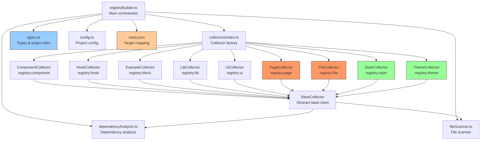

## File structure

```
packages/registry/server/
├── hooks/
│   └── index.ts                  # Nitro build hook → calls registryBuilder
├── routes/
│   ├── [component].json.ts       # HTTP handler: return registry item by name
│   ├── index.ts                  # index route
│   └── mcp.ts                    # MCP server endpoint
├── collectors/                   # Collector implementations for each type
│   ├── baseCollector.ts          # Abstract base (validation, dependency analysis, resolveTarget)
│   ├── componentCollector.ts     # registry:component
│   ├── hookCollector.ts          # registry:hook (composables)
│   ├── exampleCollector.ts       # registry:block
│   ├── libCollector.ts           # registry:lib
│   ├── uiCollector.ts            # registry:ui
│   ├── pageCollector.ts          # registry:page  (target required)
│   ├── fileCollector.ts          # registry:file   (target required)
│   ├── styleCollector.ts         # registry:style  (JSON-only, cssVars/css)
│   ├── themeCollector.ts         # registry:theme  (JSON-only, cssVars)
│   └── index.ts                  # Factory: createDefaultCollectors()
└── utils/
    ├── config.ts                 # Project config (baseName, baseUrl, etc.)
    ├── types.ts                  # Shared types + target-required rules + TargetMeta
    ├── dependencyAnalyzer.ts     # ts-morph import parsing & dependency analysis
    ├── fileScanner.ts            # General file traversal & source extraction
    └── registryBuilder.ts        # Lightweight main orchestrator
```

## Target rules

The single source of truth for which types require a `target` is `TARGET_REQUIRED_TYPES` in `types.ts`.

Target resolution order (managed by `resolveTarget()` in `baseCollector.ts`):

1. Explicit mapping in `meta.json` (highest priority)
2. Collector-provided fallback defaults
3. `undefined` (only for optional types)

| Type                 | target   | Default behaviour               |
| -------------------- | -------- | ------------------------------- |
| `registry:component` | optional | unset (handled by shadcn-vue)    |
| `registry:hook`      | optional | unset (can be overridden by meta.json) |
| `registry:lib`       | optional | unset (can be overridden by meta.json) |
| `registry:ui`        | optional | unset                            |
| `registry:block`     | optional | unset                            |
| `registry:page`      | **required** | `pages/<relative-path>`         |
| `registry:file`      | **required** | explicitly set by the collector |
| `registry:style`     | —        | JSON-only, no files              |
| `registry:theme`     | —        | JSON-only, no files              |

## meta.json

Located at `packages/elements/meta.json`, this file stores `path → target` mappings:

```json
{
  "targets": {
    "pages/ChatPage.vue": "pages/chat/index.vue",
    "files/ai-config.ts": "config/ai-config.ts"
  }
}
```

All collectors consult `meta.json` when resolving a `target`, and fall back to defaults afterwards. This allows `target` values to be adjusted without changing source code.

## Collector types

| Collector         | Source                          | Included in all.json | Included in registry.json |
| ----------------- | ------------------------------- | -------------------- | ------------------------- |
| Component         | Scans `src/components/`         | ✅                   | ✅                        |
| Hook              | Scans `src/composables/`        | ✅                   | ✅                        |
| Lib               | Scans `src/lib/`                | ✅                   | ✅                        |
| UI                | Scans `src/ui/`                 | ✅                   | ✅                        |
| File              | Scans `src/files/`              | ✅                   | ✅                        |
| Example           | Scans `packages/examples/src/`  | ❌                   | ✅                        |
| Page              | Scans `src/pages/`              | ❌                   | ✅                        |
| **Style**         | Reads `src/styles/*.json`       | ❌                   | ✅                        |
| **Theme**         | Reads `src/themes/*.json`       | ❌                   | ✅                        |

## Extension steps

Adding a new type requires three steps:

1. Add a configuration entry in `REGISTRY_TYPE_CONFIGS` (`types.ts`).
2. Create a new collector that extends `BaseCollector`.
3. Register it in `createDefaultCollectors()` inside `collectors/index.ts`.

For JSON-only types (e.g. style/theme), override the `collectAndBuild()` method.
